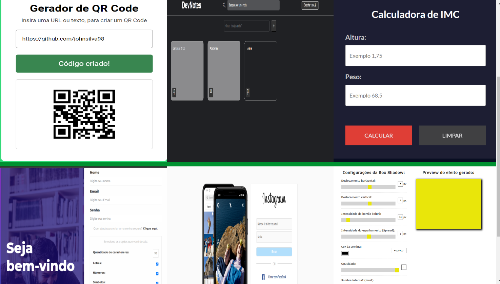

<h1 align="center">Projetos React JS</h1>

    
    
Este projeto é um repositório de exemplos de projetos realizados com o framework ReactJS.

    
Os projetos são do curso de ReactJS da comunidade Hora de Codar com o professor <a href="https://github.com/matheusbattisti">Matheus Battisti</a>

## Projetos 🚀

[Clique aqui para acessar meu portfólio com os projetos](https://jonathansilva-portfolio.vercel.app/)
